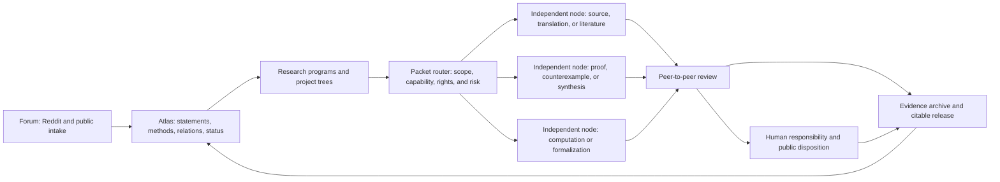

# The Mathematics Commons

## A Leiden-led, federated infrastructure for mathematical work and discovery

**Discussion draft — 6 August 2026**  
**Proposed method: peer-to-peer review**

## Abstract

This paper proposes **The Mathematics Commons**: an open, federated network in which independently operated human–AI nodes perform bounded mathematical work, review one another's artifacts, preserve exact evidence, and consolidate what is learned into a shared map of mathematics.

The proposal is deliberately broader than a repository of community-created conjectures. It supports literature and open-status audits, proof and counterexample search, computation, formalization, source recovery, transcription, translation, canonical editions, semantic integration, review, and archival publication. A conjecture is one possible node in the system, not its organizing limit. The enduring product is an **Atlas** connecting sources, statements, proofs, counterexamples, methods, assumptions, formalizations, translations, corrections, and structural relationships across fields.

The operating method is **peer-to-peer review**. One node produces a bounded, versioned artifact; other nodes independently source-check, reproduce, challenge, formalize, translate, integrate, or archive it. Git provides distributed version history and transport. GitHub can initially serve as a convenient rendezvous point without becoming the sole scientific record. Proof assistants, exact computation, deterministic replay, source comparison, and domain review provide method-appropriate evidence. Humans remain the authors and retain responsibility for every promoted mathematical claim.

The proposal adopts the complete [Leiden Declaration on Artificial Intelligence and Mathematics](https://leidendeclaration.ai/) as its leading ethical and scientific framework. The Declaration is read here as a constructive answer to AI-assisted mathematics: not a reason to stop doing mathematics with automated tools, but a specification for doing it without sacrificing proof, understanding, attribution, review, autonomy, access, author rights, or ethical responsibility. The Commons' clause-by-clause operational interpretation is maintained in the [Durable Requirements](MATHEMATICS_COMMONS_DURABLE_REQUIREMENTS.md).

## Executive summary

The Commons has seven parts:

1. **The Forum** receives problems, questions, corrections, and proposed connections from Reddit and other communities.
2. **The Atlas** is a versioned, searchable map of mathematical objects and the relationships among them.
3. **Research Programs** organize work across families of problems, methods, or structures rather than creating an isolated repository for every conjecture.
4. **The Mesh** consists of independently operated human-and-AI nodes that perform literature searches, proof attempts, computations, formalization, and adversarial review.
5. **The Evidence Archive** preserves citable releases, source material that can lawfully be shared, proof-assistant files, exact certificates, review records, and cryptographic manifests.
6. **Research Packets** turn heterogeneous work into bounded, versioned, independently reviewable units with exact inputs, outputs, rights, resource limits, and acceptance tests.
7. **The Node Kit** lets a contributor obtain a compatible packet, open it with an existing local agent, and return a portable evidence bundle without needing to understand Git.

The central design rule is simple:

> No claim advances because several AI systems agree. It advances because the statement, evidence, provenance, and review record meet explicit public criteria.

The recommended first product is deliberately less ambitious than the full architecture: one GitHub-native pilot repository, a small schema set, agent-readable instructions, simple capability labels, selected Erdős/open-problem and community-conjecture lanes, a small human stewardship team, and one complete review-and-release cycle. A custom Node Kit, automatic routing, archival project variants, broad public onboarding, and pooled local compute follow only after the protocol proves that it catches errors and produces durable work.

## 1. Why this is timely

Recent events show that AI-assisted mathematical discovery is no longer a hypothetical use case. They also show why a trustworthy shared workflow is needed.

| Case | What happened | What the Commons should learn |
|---|---|---|
| Large-scale Erdős review | A Gemini study attempted 700 entries. In its detailed third version, 200 candidates were definitely graded: 137 were fundamentally flawed, 63 technically correct, and 13 meaningfully correct after exact-statement and literature review. The apparent novel count fell during audit to four, including partial answers. | Generation is cheap relative to exact-statement review, literature reconciliation, and significance assessment. Counts and classifications must be versioned because they change under scrutiny. ([Feng et al., 2026](https://arxiv.org/abs/2601.22401)) |
| Erdős problem #1196 | Liam Price submitted the problem to GPT-5.4 Pro in a single prompt. The model found a fruitful route, but specialists described the raw proof as poor and reconstructed a short rigorous argument. The method then suggested wider connections among primitive-set problems. | A non-specialist can surface a real insight. That insight becomes mathematics only after statement checking, expert reconstruction, prior-art review, and clear attribution. ([Scientific American account](https://www.scientificamerican.com/article/amateur-armed-with-chatgpt-vibe-maths-a-60-year-old-problem/), [problem record](https://www.erdosproblems.com/1196)) |
| Planar unit distances | An OpenAI model constructed configurations disproving Erdős's long-believed bound \(u(n)=n^{1+o(1)}\), using ideas from algebraic number theory. This is a major result about the problem, although it does not determine the full asymptotic behavior of \(u(n)\). | Cross-field transfer can be more important than brute-force search. Public descriptions must state exactly which conjecture was refuted and which larger problem remains. ([proof announcement and companion material](https://openai.com/index/model-disproves-discrete-geometry-conjecture/)) |
| Jacobian conjecture | Levent Alpöge's announcement credited Anthropic's Claude Fable with finding an explicit polynomial map in three variables having constant nonzero Jacobian and three distinct points in one fiber. Exact algebra, independent expositions, and formal checks followed. The conjecture is thereby false in dimensions at least three; the two-variable case remains open. | Counterexample search, compact exact witnesses, independent reconstruction, and formal checking form an unusually strong review chain. The public record should qualify the degree of autonomy when a complete reproducible interaction is unavailable, and the residual problem must remain visible. ([explicit account](https://www.ulam.ai/research/jacobian.pdf), [Tao's mathematical digestion](https://terrytao.wordpress.com/2026/07/21/a-digestion-of-the-jacobian-conjecture-counterexample/), [Lean development](https://github.com/alerad/alpoge-lean)) |
| Archival status correction | AI-assisted literature searches have repeatedly found older papers that settle or partially settle entries still listed as open. Terence Tao has described literature review as among the most productive near-term uses of AI in mathematics. | Finding that a problem was already solved is a successful outcome, not a failed attempt at novelty. The Atlas should update the mathematical record while preserving the original sources and discoverers. ([Tao's record of AI contributions](https://github.com/teorth/erdosproblems/wiki/AI-contributions-to-Erd%C5%91s-problems), [Tao's literature-review note](https://mathstodon.xyz/@tao/115385022005130505)) |

These examples should not be collapsed into a single tally of “problems solved by AI.” They differ in novelty, difficulty, autonomy, evidence, and community acceptance. The public Erdős tracker itself warns that it is not a benchmark, that many statuses are provisional, that obscurity is not difficulty, and that problem solving is only one part of mathematical research. The Commons should preserve those distinctions rather than turn mathematics into a leaderboard.

The deeper opportunity is what Tao has called a move from isolated case studies toward population studies of mathematics: surveying many problems, dependencies, and techniques at once. A connected Atlas can make those surveys cumulative instead of repeatedly starting from zero.

## 2. Purpose and scope

The Commons exists to accelerate and consolidate mathematical discovery while preserving proof, understanding, attribution, and human responsibility.

Its outputs include:

- authoritative source inventories, rights records, and scan recovery;
- diplomatic transcriptions and separately corrected canonical editions;
- source-aligned translations, terminology records, and multilingual readers;
- exact problem statements and corrected formulations;
- literature and historical-status reviews;
- new proofs, counterexamples, bounds, reductions, and special cases;
- failed approaches with precisely identified failure points;
- reproducible computations and independently replayed certificates;
- Lean, Coq, Isabelle, or other formal developments with explicit informal-to-formal correspondence;
- reusable lemmas, methods, datasets, and proof patterns;
- evidence-backed connections among theories and fields;
- semantic indexes and provisional integration scaffolds for resources such as the Stacks Project;
- correction, review, release, and archival records;
- reader-friendly syntheses and conventional research papers.

This scope matters. A network optimized only to announce solutions will reward overclaiming and discard much of the work that makes future solutions possible. A network that records assumptions, obstructions, negative results, and reusable structure becomes a mathematical memory.

It also permits broad integrability. A contribution does not need to be a theorem to become durable mathematical work. Five accurately transcribed pages, an independently checked translation, a resolved citation, a rejected false proof, a formal statement-correspondence review, or a verified archival release can each be complete contributions when represented by the right packet and acceptance tests.

## 3. The Leiden Declaration as the leading framework

The Commons is designed to operationalize the complete [Leiden Declaration on Artificial Intelligence and Mathematics](https://leidendeclaration.ai/), version 1 of 2 June 2026. The Declaration was developed through extensive community consultation and is endorsed by the International Mathematical Union. That gives it substantial standing as a statement of mathematical values; it does not certify or endorse this particular project.

The Commons adopts an enabling interpretation. Leiden recognizes that mathematicians may choose whether and how to use AI and that the technology may contribute to discovery. Its safeguards answer the more important question: how can that work expand without degrading proof, understanding, attribution, independent verification, fair evaluation, research autonomy, human development, author rights, or care for people and the environment?

The complete normative crosswalk is maintained in the [Mathematics Commons Durable Requirements](MATHEMATICS_COMMONS_DURABLE_REQUIREMENTS.md). That document maps every value, threat, and recommendation for individuals, organizations, funders, policymakers, and industry to an internal control or an explicit public position. The following are the leading commitments.

### Privacy presumption for everything below

All disclosure, provenance, reproducibility, and archival commitments below are subject to legitimate privacy, confidentiality, security, copyright, third-party-rights, and legal constraints. Ordinary AI interactions are private by default. Choosing to contribute a mathematical artifact does not imply consent to publish prompt histories, raw transcripts, hidden reasoning or chain-of-thought, private notes, unpublished communications, personal context, credentials, or unrelated local data. Raw interaction records are published only by a contributor's specific affirmative choice after an appropriate review.

The public record asks for no more than ordinary mathematical, academic, institutional, and venue-specific integrity requires: a sanitized account of material tools and their role, the functional task conditions needed for evaluation, supporting sources and artifacts, checks performed, limitations, and relevant disclosure gaps. A prompt or transcript is process provenance, not proof, authorship, or a magical explanation of theorem-level work. The mathematics must stand on independently checkable arguments and evidence. Empirical claims about a model's autonomy or performance may require a more detailed protocol, but privacy still favors a sanitized protocol and a qualified claim over coerced publication of private conversations.

This presumption applies module by module. Each packet, runner, review, and evidence bundle minimizes data, declares what is public or private before submission, excludes unrelated local state by default, and retains no private material merely because it might later be useful.

Here, “private by default” describes the Commons' own collection and publication boundary. It is not a promise about a chosen provider's retention, training, account, or legal terms; contributors must assess those separately and disclose material limitations.

### 3.1 Proof, understanding, and proportionate rigor

- Every output is typed honestly as transcription, translation, source finding, heuristic, experiment, computation, conjecture, informal proof, formal theorem, counterexample, review, or synthesis.
- A promoted theorem includes a human-readable central argument and an understanding artifact explaining why the method works, how it relates to prior mathematics, its limitations, and the questions it creates.
- Formal verification is required when feasible and proportionate to the claim's risk and importance. It supplements rather than replaces review of the human-to-formal translation.
- Formal artifacts disclose their trust base: toolchain and library versions, axioms, generated code, external oracles, and unresolved placeholders.
- When present-day formal libraries cannot economically represent the mathematics, the project records that limitation and uses the strongest appropriate alternative: independent reconstruction, expert review, exact computation, certified bounds, or theoretical/computational cross-checks.
- Generation throughput is constrained by review capacity. Cheap AI output does not acquire a claim on scarce reviewer attention merely by existing.

### 3.2 Human authorship, responsibility, and distributed credit

- Automated systems never occupy author or accountable-signatory fields.
- Every promoted mathematical claim names at least one human who accepts responsibility for the exact version's correctness, adequacy, and citation completeness and can explain its central argument and limitations.
- Operating a compute node is a real contribution but does not automatically create authorship or responsibility for the mathematics produced on it.
- Credits distinguish source recovery, transcription, translation, problem origin, discovery, proof development, computation, formalization, prior-art identification, review, exposition, maintenance, and release work.
- Reviewers own only the scope of review they declare. Stewards own process integrity, not every theorem in the network.
- The project uses no scalar reputation system and does not treat credentials, institutional affiliation, compute ownership, or model tier as mathematical authority.
- Academic authorship, priority, responsibility, prizes, and professional recognition remain distinct from copyright. Commons-originated material is CC0; human authorship under Leiden neither depends on nor creates exclusive ownership of that material.

### 3.3 Disclosure, attribution, rights, and open science

- Every material run, review, and release carries a proportionate tool and computational-resource disclosure covering models, providers, modes, dates, sanitized functional task specifications, material human interventions, proof assistants, solvers, relevant compute, checks performed, and known reproducibility limits.
- Reviewers disclose their own permitted AI assistance and remain responsible for their recommendations. Prompt histories, raw transcripts, private reasoning, credentials, personal data, unpublished communications, and irrelevant conversations are private by default and are neither demanded nor published without a specific affirmative choice and review.
- Mathematical claims stand on their public arguments and evidence, not on a prompt or private interaction history. Where a particular instruction is genuinely material to evaluation, its functional content is summarized without forcing disclosure of the contributor's surrounding conversation.
- Novelty and open-status claims require logged searches, including non-English sources where relevant, and direct inspection of the works relied upon. A generated citation is a lead; “no source found” is not “no source exists.”
- Every source records provenance, integrity, copyright or license status, permitted transformations, and access restrictions. Public availability is not treated as automatic consent for model training.
- Provenance covers ideas as well as files: problem nominations, workflow proposals, source leads, sanitized task specifications or voluntarily disclosed prompts, prior attempts, and conceptual suggestions that materially shape an artifact retain their originator where the contributor has made the attribution lawfully publishable. Public pseudonyms are credited without deanonymization; provenance does not compel raw-transcript disclosure; uncertainty is recorded rather than silently reassigned.
- Mature releases use stable identifiers, explicit licenses, open formats, versioned archives, and independent mirrors. Where evidence cannot lawfully be opened, the metadata, restriction, provenance, and maximum lawful verification material remain public.
- Commons-originated material remains CC0 through later review and publication, modulo pre-existing third-party rights. A publisher may not receive exclusive control over the Commons artifact or require removal of its public record.
- “Commons-originated” includes every new component submitted through the workflow—proofs, computations, formalizations, code, metadata, reviews, corrections, translations, transcriptions, and exposition. Where no copyright exists, CC0 confirms the intended status; where a contributor may hold rights, contribution to the workflow dedicates them. This does not erase rights in incorporated sources.

### 3.4 Evaluation, publication, and public communication

- Correctness, novelty, depth, difficulty, significance, human contribution, model contribution, review maturity, and external publication status remain separate assessments.
- Peer-to-peer review is internal pre-publication and continuing post-publication infrastructure. It does not replace journals, proceedings, books, or broader mathematical scrutiny.
- Significant results proceed toward an appropriate external peer-reviewed venue and ordinarily receive specialist pre-submission review before extraordinary publicity.
- Reddit posts, blogs, press releases, and company announcements may summarize work only when they link to reviewable evidence and state the exact result, limitations, prior human foundations, automation role, and residual open questions.
- The Commons does not use isolated mathematical successes as evidence of a product's general intelligence and does not permit model-provider marketing to determine scientific status.

### 3.5 Autonomy, tool choice, ethics, and partnerships

- Human mathematical communities choose research questions because of intellectual, historical, educational, or societal significance—not merely because a model can address them or a sponsor can publicize them.
- Tool choice considers provider conduct, source and training rights, privacy, openness, reproducibility, access, energy and material cost, and whether a smaller, local, non-proprietary, or non-AI method suffices.
- A result may be delayed, a tool declined, or work withdrawn when the available method or partnership materially conflicts with these values.
- Programs and consequential packets receive proportionate ethical review for foreseeable use in warfare, oppression, mass surveillance, anti-democratic systems, or other serious harms.
- Funding, compute donations, conflicts, and contractual constraints are disclosed. Partners receive no truth authority, agenda control, ownership by default, or right to suppress criticism, correction, or required scientific disclosure.
- The Commons supports public-interest computational infrastructure, protective author rights, freedom of conscience, and meaningful public oversight of harmful AI uses.

### 3.6 Welcoming contributors and preserving standards

The Declaration explicitly welcomes contributors from other disciplines and asks mathematics to make its standards and practices accessible. The Commons implements that instruction through clear packet specifications, multilingual documentation, calibration examples, non-Git interfaces, low-resource and non-AI lanes, and many separately credited contribution types.

The evidentiary standard belongs to the artifact. The same claim requires the same proof and review whether it arrives from an amateur, a professor, a company laboratory, or an automated workflow. Expertise remains essential to evaluate advanced work, but it is demonstrated and applied claim by claim rather than inferred as a permanent personal rank.

### 3.7 Auditable alignment, not a decorative sticker

Every mature release should publish a Leiden conformance manifest identifying each requirement as implemented, partially implemented, a policy commitment, or not yet implemented. No aggregate score may hide a failed requirement. Any public badge must say **Designed to align with the Leiden Declaration — self-assessed**, link to the exact protocol version and conformance report, and imply no official certification.

## 4. The system: Forum, Atlas, Programs, Packets, Mesh, and Archive



### 4.1 The Forum

Reddit can remain the approachable social and intake layer: monthly threads, explanations, proposals, questions, and concise result summaries. It should not be the only record. A moderator or contributor turns a worthwhile post into a structured intake item, and the repository links back to the original discussion.

People should be able to suggest or review a problem without learning Git. A web form or GitHub issue form can collect the initial information, and a steward can perform the technical filing.

### 4.2 The Atlas

The Atlas is the unifying layer. It stores versioned objects such as:

- problem, conjecture, theorem, lemma, definition, and counterexample;
- proof, computation, formalization, and review;
- mathematical structure, method, obstruction, and theorem role;
- source, contributor, agent run, and release.

Each object receives a stable identifier. Relationships are typed and evidenced, for example:

- `depends_on`, `uses_method`, `formalizes`, `contradicts`;
- `generalizes`, `specializes`, `reduces_to`, `equivalent_to`;
- `isomorphic_to`, `functorial_relation`, `shared_universal_property`;
- `shared_proof_pattern`, `historical_predecessor`, `analogy_only`.

The final relation is important. A suggestive analogy is useful exploratory mathematics, but it must not silently become an equivalence.

### 4.3 Research Programs

Active work is grouped by a coherent family of questions or methods: additive number theory, reconstruction and local-to-global principles, maximal operators, formalized finite combinatorics, reverse mathematics, and so on. A program can contain many conjectures and can export reusable results to other programs.

The network should avoid both extremes at launch: one enormous undifferentiated repository and one repository per conjecture. The pilot uses one repository with program folders. Mature programs split into independent repositories when they develop distinct maintainers, tooling, or release schedules.

### 4.4 Research Packets

A Research Packet is the smallest independently claimable and reviewable unit. It contains a stable ID; exact scope, exclusions, dependencies, and stopping conditions; source identifiers, rights, and hashes; expected JSON, LaTeX, code, image, or review outputs; acceptance tests; resource and permission envelopes; a data-minimization and publication boundary; and its required review path.

The same protocol supports different project-tree variants. A conjecture tree may emit literature, lemma, counterexample, computation, and formalization packets. An archival tree may emit source-authority, scan segmentation, transcription, translation, correction, diagram, terminology, semantic-integration, and release packets. These are not secondary chores surrounding “real” theorem work. They are durable mathematical contributions with task-appropriate evidence.

Current corpus workflows already demonstrate the pattern: bounded page ranges, stable semantic IDs, diplomatic and corrected layers, independent checker lanes, append-only correction ledgers, provisional Stacks mappings, build and visual QA, checksum manifests, and archival releases. The packet protocol generalizes those working practices instead of inventing a separate abstraction.

### 4.5 The Node Kit and capability router

The Node Kit is a signed, downloadable project interface readable by both a person and their existing local agent. It contains a human quick start, `START_HERE_FOR_AGENTS.md`, schemas, validators, project adapters, and a single contribution command or button. It returns a portable, privacy-reviewed evidence bundle rather than merely an answer in a chat; the underlying chat remains private unless the contributor deliberately includes an approved excerpt.

The pilot does not build that complete interface. Its Node Kit is simply a clone or download containing the start files, packet JSON, templates, and one validation script. Stewards may perform the Git operations while the initial contributors test the research protocol.

Before receiving work, a node declares a bounded capability profile: available time and budget, context limits, CPU/RAM/GPU/storage, permitted network and code execution, installed formal or archival tools, languages, and provider or licensing preferences. User-facing presets may map current subscription plans into `light`, `standard`, `extended`, or `local-compute` envelopes, while the durable schema records actual capabilities rather than temporary product prices.

The router offers only compatible packets and explains why they fit. Large projects are decomposed into dependency-aware packets so that a small model can complete a useful citation check or five-page transcription while a larger context and budget can take a corpus reconciliation or long proof-review packet. Compute determines feasible packet size, never truth, credit, authorship, or voting power.

### 4.6 The Mesh

A node is any independently operated contributor workflow: a person with a laptop, a locally controlled agent client, a university group, a formalization team, or a compute service. “Local agent” describes where the participant controls the workflow; its model inference may still occur through a remote provider and must be disclosed. Nodes claim bounded work packets, work from an exact source commit, and return reviewable artifacts.

Nodes may advertise capabilities such as literature languages, Lean, Coq, Isabelle, SMT, exact algebra, interval arithmetic, OCR, typesetting, CPU, or GPU. Compute does not confer voting power or truth authority. Useful non-AI lanes remain available, and contributors may decline a provider, tool, task, or partnership.

### 4.7 The Evidence Archive

Git stores text, small source files, schemas, and history. Large certificates, datasets, PDFs, and release bundles live in an archival service such as Zenodo, with URLs, versions, licenses, byte sizes, and SHA-256 hashes committed to Git. Each mature release has a human reader, machine-readable manifests, and exact reproduction instructions.

## 5. Consolidation and the “unified mathematics” layer

The unit of organization is a connected mathematical object, not merely an open problem. This permits work at three levels.

### 5.1 Dependency and assumption mapping

For each proof, the Atlas can record which definition, hypothesis, or structure is used at each step. It must distinguish:

- assumptions used by this proof;
- assumptions currently known to be sufficient;
- assumptions proved logically necessary;
- assumptions suspected to be removable.

This supports proof minimization, reverse-mathematical questions, theorem transport, and reuse of lemmas in weaker settings.

### 5.2 Comparing theorem roles

Theorems in different fields may play the same role without having directly comparable statements. A role card can describe:

- input or local data;
- compatibility conditions;
- admissible morphisms;
- obstructions;
- existence of a global object;
- uniqueness or canonicity;
- stability under change of context.

This makes questions such as “Do these reconstruction theorems share a universal pattern?” testable. Category theory may provide the right language for some relationships; reverse mathematics, model theory, proof theory, or explicit algebra may provide it for others. The system records the strongest relation actually supported by evidence.

### 5.3 Population-level synthesis

Periodic Atlas reports should ask:

- Which open problems reduce to the same unresolved lemma?
- Which counterexamples exploit the same obstruction?
- Which assumptions recur across apparently unrelated theories?
- Which informal theorems are close to existing formal-library declarations?
- Which old “open” statuses are likely literature gaps?
- Which agent-discovered methods transferred successfully to neighboring problems?

These syntheses are themselves reviewable mathematical products. They provide the general, connected character that a list of conjecture repositories cannot.

## 6. Peer-to-peer review

Peer-to-peer review is a protocol among independently operating research nodes. The word “peer” describes their role in the review network; it does not assign personhood or authorship to an AI system.

### 6.1 Standard review cycle

1. **Intake and statement freeze.** Record exact quantifiers, conventions, provenance, known results, edge cases, and what would count as resolution.
2. **Independent literature passes.** At least two search lanes work separately. A citation auditor opens the sources and checks that they say what the record claims.
3. **Decomposition.** Convert the problem into bounded work packets: prove a lemma, attack an implication, search a finite space, reproduce a computation, or formalize a definition.
4. **Isolated first attempts.** Prover and skeptic lanes work from the same frozen statement without seeing one another's conclusions when feasible. Model diversity is useful, but two agents are not independent merely because they have different names.
5. **Adversarial review.** Review assumptions, edge cases, hidden case splits, citations, exact computations, and the strongest plausible counterexamples.
6. **Reproduction or formalization.** Rebuild artifacts from a clean environment. Formalize a proportionate core and review its correspondence with the paper statement.
7. **Synthesis.** Produce the shortest honest argument, list residual gaps, and connect reusable components back into the Atlas.
8. **Human disposition.** A responsible human approves the exact release as proved, disproved, partial, known, conditional, exploratory, challenged, or withdrawn.
9. **Release and correction.** Tag and archive an immutable version. Later corrections supersede or retract it without deleting the historical record.

### 6.2 Separate evidence facets

A single confidence score would hide the distinctions that matter. Every result instead displays independent facets:

| Facet | Example states |
|---|---|
| Mathematical status | open, known, partial, proved, disproved, ill-posed |
| Literature status | unchecked, searched, source-audited, priority review pending |
| Proof review | unreviewed, agent-critiqued, independently reconstructed, human-reviewed, specialist-reviewed |
| Computation | exploratory, exactly replayed, independently reproduced, certified bounds |
| Formalization | none, partial, compiles, no placeholders, correspondence reviewed |
| Release responsibility | none, named human sponsor, peer-reviewed publication |

A Lean badge cannot erase an incomplete literature review. Two favorable model reviews cannot replace an exact computation. A specialist's approval cannot make code reproducible. The facets complement one another.

### 6.3 Review roles

Useful roles include coordinator, literature scout, citation auditor, explorer, prover, skeptic, counterexample hunter, reproducer, formalizer, formal-correspondence reviewer, synthesis editor, and release curator. No agent reviews its own output for promotion. Agent reviews are evidence; accountable release approval is human.

## 7. Technical architecture and federation

### 7.1 Pilot topology

Begin with one public GitHub organization and one repository:

```text
mathematics-commons/
├── START_HERE_FOR_HUMANS.md
├── START_HERE_FOR_AGENTS.md
├── governance/
├── registry/
│   ├── problems/
│   ├── community-conjectures/
│   └── sources/
├── packets/
│   ├── ready/
│   ├── claimed/
│   ├── submitted/
│   └── closed/
├── claims/
├── reviews/
├── formal/
├── schemas/
├── tools/
├── releases/
└── .github/
    ├── ISSUE_TEMPLATE/
    ├── pull_request_template.md
    ├── CODEOWNERS
    └── workflows/
```

All substantive mathematical claims, reviews, decisions, and status changes eventually become committed files. GitHub issues and discussions help coordinate work, but they are not durable mathematical archives and are not included in an ordinary Git clone.

### 7.2 The pilot Git flow

The pilot needs no exotic network technology. Git already gives every clone the complete version history.

1. The public repository is the initial rendezvous point and protected integration branch.
2. A contributor forks or clones it, chooses one `ready` packet, and records a short lease.
3. Work occurs on a branch containing only that bounded packet and its required evidence.
4. A pull request runs schema, citation, build, disclosure, rights, and security checks.
5. Independent reviewers add version-bound review files; comments alone are not the durable review record.
6. A maintainer merges only after the packet's stated gates pass.
7. A scheduled bare mirror copies the complete Git history to independently controlled storage or another forge.
8. Release bundles and manifests are deposited in an external archive such as Zenodo.

This is decentralized enough for the proof of concept: work, compute, clones, checking, and backups are distributed, while one visible repository keeps coordination understandable. Bidirectional automatic mirroring and conflict resolution are deferred; reviewed one-way mirrors are safer during the pilot.

### 7.3 Scaled topology

When the pilot develops multiple active maintainer groups, split into:

- `commons-standards`: charter, schemas, templates, and review protocol;
- `commons-atlas`: registry, relations, mirror locations, and generated index;
- `program-*`: autonomous research-program repositories;
- `commons-formal`: only genuinely reusable formal components;
- `commons-tools`: optional open validators and isolated worker tooling.

Each program publishes a small state manifest containing its project ID, schema version, current release tag and commit, known mirrors, claim statuses, and archival identifiers. The Atlas indexes those declarations. It does not create truth by decree, and it may list competing forks that support, challenge, or supersede one another.

### 7.4 What “decentralized” means here

Git is distributed; GitHub is a centralized service. During the pilot, GitHub is the rendezvous point, while research labor, compute, clones, and verification are distributed. Resilience requires:

- mathematically material state stored in Git files;
- one-way mirrors or bare clones on independently controlled infrastructure;
- periodic exports of issue and review metadata that matter historically;
- immutable releases archived outside GitHub;
- explicit, reviewed synchronization instead of automatic bidirectional merging.

This design allows the network to leave GitHub without losing its mathematics. A later federation may use other forges, but the pilot does not need a blockchain, token, or custom distributed database.

### 7.5 Automated gates

GitHub Actions or an equivalent CI system should validate:

- metadata schemas and stable references;
- source and artifact hashes;
- deterministic tests and exact certificate replay;
- pinned Lean and mathlib builds;
- absence of `sorry`, `admit`, or unapproved axioms;
- correspondence maps between informal and formal statements;
- licenses, citation metadata, and required disclosure fields;
- secrets, unsafe archive paths, and private machine information.

Protected branches should require pull requests, current status checks, and human review. GitHub's [repository rulesets](https://docs.github.com/en/repositories/configuring-branches-and-merges-in-your-repository/managing-rulesets/available-rules-for-rulesets) support required reviews and status checks.

Public pull requests must never execute arbitrary contributed code on a personal self-hosted runner. GitHub warns that self-hosted runners can be persistently compromised by untrusted workflows. Use ephemeral hosted runners for bounded checks; run expensive or untrusted workloads in isolated, resource-limited environments with no secrets or sensitive network access. ([GitHub secure-use guidance](https://docs.github.com/en/actions/reference/security/secure-use))

## 8. Accessibility and broad integrability

Two commitments belong here and should not be collapsed into one slogan.

**Accessibility and inclusion** concern who can enter and use the Commons. The mature system should support multiple languages and scripts, non-English and non-Western source programs, assistive technology, low-bandwidth and mobile access, non-Git submission, affordable and non-proprietary tool paths, and transparent standards. English may be a coordination language without becoming the sole authoritative form of the mathematics.

**Broad integrability** concerns which contributions can enter the durable record. The packet system should integrate source finding, transcription, translation, terminology work, citation checking, literature research, proof, counterexample, computation, formalization, exposition, review, correction, semantic integration, and preservation. It should also preserve valuable negative results and failed approaches.

The distributed workflow naturally weakens the isolated-genius mythology: a mature result visibly depends on sources, prior authors, problem setters, explorers, proof developers, computational workers, formalizers, translators, reviewers, editors, and archivists. This is not a claim that expertise is unnecessary. It makes expertise and contribution specific, visible, and testable instead of treating mathematical authority as an indivisible personal essence.

The immediate pilot is narrower. Its initial participants are expected to know how to operate their chosen AI tools, and stewards can assist with Git. They enter through four paths:

1. **Propose.** Add an established open problem, a literature lead, or a carefully stated community conjecture.
2. **Investigate.** Work on a bounded literature, proof, counterexample, computation, or formalization packet.
3. **Check.** Reproduce an artifact, inspect a source, attack a proof, or review formal-statement correspondence.
4. **Steward.** Maintain packets, status records, releases, and correction paths.

The interface tells everyone what evidence an artifact presently supports and what review remains. It does not assign people a general mathematical rank. Every path repeats three domain rules: AI output begins as a proposal; finite computation proves only its certified scope; and failure to locate prior art is not proof that none exists.

Later onboarding may turn this into a one-click “point spare compute at useful mathematics” experience. That is a legitimate design target, not a feature claimed by the first GitHub pilot.

## 9. Governance, credit, and disputes

### 9.1 Human roles

- **Commons stewards** maintain the charter, schemas, and appeals process.
- **Program maintainers** manage bounded subject or method areas.
- **Responsible sponsors** accept responsibility for individual releases.
- **Reviewers** assess exact commits and declare conflicts of interest.
- **Release curators** assemble artifacts but do not decide correctness alone.

Major governance changes require a public proposal and recorded decision. Mathematical disagreement is resolved by evidence and may legitimately produce maintained competing branches.

### 9.2 Credit

Credits distinguish problem origin, discovery, proof development, formalization, computation, review, prior-art identification, exposition, and maintenance. AI involvement appears in the tool and run record. Human authorship is attached only to people willing to take the corresponding responsibility.

No scalar leaderboard or token should be launched. It would reward volume, invite manipulation, and collapse incomparable work. A role-specific contribution record can instead preserve accepted formalizations, independent reproductions, major defects found, corrections initiated, and reviews later confirmed or overturned.

### 9.3 Challenges and corrections

A released result is never silently edited. A challenge names the exact claim and commit, supplies evidence, and receives a public disposition. Outcomes include upheld, corrected, superseded, or withdrawn. The old version remains citable and clearly marked.

## 10. Security, rights, and resource use

- Treat contributed code, archives, papers, prompts, websites, and solver output as untrusted input.
- Never expose credentials to a fork or unreviewed workflow.
- Treat each module as a separate privacy boundary: allowlist only the files, services, destinations, and public fields required for the bounded task; deny unrelated local context by default; label temporary and restricted data; and preview the exact bundle before publication.
- Do not collect or publish prompt histories, raw transcripts, private conversations, personal data, or unpublished communications merely because an agent used them. Publication requires the contributor's specific affirmative choice plus any authority or consent otherwise required.
- Record access, copying, translation, redistribution, and model-training permissions separately. A freely downloadable preprint is not automatically licensed for translation or training, and a historical work's public-domain status does not automatically settle the rights in every scan, edition, annotation, or translation.
- Store bibliographic records and lawful excerpts rather than redistributing paper collections without a reviewed basis.
- Pin dependencies and preserve exact environments for cited computations.
- Prefer exact arithmetic or certified error bounds when a numerical result supports a theorem.
- Set informed and revocable compute budgets, time limits, cancellation rules, and environmental reporting appropriate to the task; permit no hidden telemetry or training.
- Prefer the smallest adequate tool, preserve useful non-AI paths, and disclose when remote proprietary inference remains part of a locally operated workflow.
- Permit contributors and maintainers to decline work, providers, funding, or partnerships whose ethical consequences conflict with the Leiden principles.
- Screen consequential programs and partnerships for threats to author rights, research autonomy, privacy, democratic life, freedom of conscience, and the environment.

## 11. The first 30-day GitHub pilot

The first month is a grassroots proof of concept for the existing AI-literate group. It tests the GitHub packet and review protocol, not broad public onboarding and not the full future Commons.

### Week 1: constitution and repository

- Name at least two organization owners and two or three stewards.
- Adopt a one-page charter plus Leiden alignment, review, correction, authorship, rights/training, security, and major-claim policies.
- Create one public repository, protected `main` branch, issue forms, pull-request template, `START_HERE_FOR_HUMANS.md`, and `START_HERE_FOR_AGENTS.md`.
- Implement only problem, packet, run, claim, and review/disposition objects.
- Create one independent one-way mirror before accepting irreplaceable work.

### Week 2: calibration set

Import approximately six to ten deliberately varied records:

- one apparently open problem already settled in the literature;
- one known theorem accompanied by a deliberately flawed candidate proof;
- three or four selected Erdős or comparable open problems with bounded literature, special-case, experiment, or formalization work;
- two or three precisely stated community conjectures, including suitable subreddit contributions; and
- at least one finite or computational packet with an exact replay.

“Open-door” is a workflow label, not a claim that a problem is easy. It means the problem offers bounded tasks that can produce useful evidence without requiring a complete solution.

### Week 3: peer-to-peer review exercise

- Run separate literature, prover, skeptic, reproduction, and formalization lanes.
- Confirm that the planted error is caught.
- Confirm that reviews become stale when the reviewed commit changes.
- Reconstruct one result from a clean clone using a single documented command.
- Test light, standard, and extended packet envelopes without tying the durable schema to current subscription prices.

### Week 4: release and resilience

- Publish a versioned pilot reader and evidence bundle.
- Create an independent mirror and reproduce the release from it.
- Post concise Reddit summaries linked to the full record.
- Publish a Leiden conformance report and a retrospective listing false positives, reviewer effort, compute cost, Git friction, disclosure or rights failures, and protocol changes.

### Pilot success criteria

- An existing contributor can give an agent the start file and a bounded packet without inventing a new workflow or prompt from scratch.
- Every public mathematical statement resolves to an exact version and source trail.
- Every candidate solution receives a dedicated falsification attempt.
- One literature correction, one exact reproduction, one formal or statement-correspondence check, and one cross-problem synthesis survive review.
- No released formal proof contains hidden placeholders or unapproved axioms.
- The project can be reconstructed without GitHub-only discussion history.
- The retrospective values caught errors and honest negative results as successes.
- A complete solution of an open problem is explicitly not required for the pilot to succeed.

## 12. Longer-term roadmap

### Phase I: grassroots GitHub protocol

Prove that the workflow works on selected Erdős/open-problem and community-conjecture records. Keep all authority human, all packets bounded, and all automation inspectable.

### Phase II: Node Kit and broader onboarding

Turn the start files, schemas, and validators into a low-friction Node Kit. Add automatic capability filtering and non-Git submission after the manual protocol is stable.

### Phase III: Atlas and program federation

Split mature programs, generate a searchable website from the committed metadata, add mirror manifests, and begin regular cross-program synthesis reports.

### Phase IV: additional project-tree variants

Adapt the packet protocol to source recovery, diplomatic transcription, canonical editions, translation, terminology, semantic integration, and archival publication. Existing inter-language corpus work supplies concrete lessons and a potential test corpus, but these are not first-pilot deliverables.

One possible program ranks rights-cleared translation packets by **marginal intelligibility gain**: expected new mathematical access per unit of translation and review effort. Foundational reach, unmet language need, pedagogy, community demand, source authority, rights, and reviewer capacity matter alongside citations. A whole preprint server may be indexed and ranked, but only works with compatible licenses or author permission enter a public translation queue.

### Phase V: distributed work exchange

Allow nodes to advertise capabilities and claim signed, bounded work packets. Add safe resource scheduling, independent replay services, and structured challenge feeds.

### Phase VI: interoperable mathematical memory

Connect Atlas objects to DOI metadata, arXiv identifiers, formal-library declarations, and external problem registries. Provide open exports so other communities can build tools without permission from a central operator.

### Phase VII: genuinely local peer-to-peer compute

Explore rights-cleared volunteer CPU/GPU workloads and local open-model inference for OCR, translation candidates, exact search, indexing, and formal-library work. This optional layer requires signed workloads, sandboxing, revocable resource limits, poisoning resistance, explicit data and training consent, and independent verification.

The suggestion to train rights-cleared specialist models on historical mathematical corpora is credited to Reddit user [u/UmbrellaCorp_HR](https://www.reddit.com/user/UmbrellaCorp_HR/), cited solely by the public pseudonym supplied for attribution.

## Conclusion

The recent AI mathematics cases justify neither dismissal nor triumphalism. They justify infrastructure.

Mathematical attention is scarce. AI systems can search a long tail of problems, translate across fields, explore constructions, formalize arguments, and repeat verification at a scale no small human community can match. They also hallucinate sources, repeat hidden prior art, formalize the wrong statement, and generate plausible nonsense faster than reviewers can absorb it.

The Mathematics Commons answers both facts with the same design: distribute exploration, make review adversarial and peer-to-peer, preserve exact provenance, separate evidence facets, and keep public responsibility human. Its ambition is not merely to solve more conjectures. It is to build a shared, durable, and increasingly connected account of what mathematics says, why it is true, how it was checked, and where its structures meet.

The immediate act is smaller than that ambition: put a handful of established open problems and community conjectures into one protected, mirrored GitHub workflow; issue bounded packets; find out whether independently operated human–AI nodes can produce and review durable evidence; and publish the failures as honestly as the successes. If that works, the same protocol can expand into the larger mathematical-memory, translation, and local-compute programs described here.

## Tool and computational resource disclosure for this draft

This discussion draft was generated and revised through an AI-assisted workflow using OpenAI Codex on 6 August 2026. The workflow analyzed the supplied r/LLMmathematics discussion, inspected representative active local corpus tasks, read the complete official Leiden Declaration, consulted the primary sources listed below, and synthesized the architecture and prose. Parallel AI research roles independently audited the Declaration, current AI-mathematics cases, architecture, and onboarding. OpenAI-hosted model inference was used; this was not a fully local model workflow. No AI system is an author. The initial public release is a proposal for comment, not a peer-reviewed mathematical publication; its named human steward is responsible for deciding whether and how to adopt, correct, or withdraw it.

## Selected sources and technical references

- [Leiden Declaration on Artificial Intelligence and Mathematics](https://leidendeclaration.ai/), 2 June 2026, DOI 10.5281/zenodo.20302944.
- [International Mathematical Union endorsement of the Leiden Declaration](https://www.mathunion.org/fileadmin/documents/2026-06/IMU_AO_CL_8_2026.pdf), Circular Letter 8/2026.
- [AI contributions to Erdős problems](https://github.com/teorth/erdosproblems/wiki/AI-contributions-to-Erd%C5%91s-problems), status archive through 30 June 2026.
- Tony Feng et al., [Semi-Autonomous Mathematics Discovery with Gemini: A Case Study on the Erdős Problems](https://arxiv.org/abs/2601.22401), version 3, 2026.
- Tony Feng et al., [Towards Autonomous Mathematics Research](https://arxiv.org/abs/2602.10177), version 3, 2026.
- OpenAI, [An OpenAI model has disproved a central conjecture in discrete geometry](https://openai.com/index/model-disproves-discrete-geometry-conjecture/), 20 May 2026.
- Terence Tao, [A digestion of the Jacobian conjecture counterexample](https://terrytao.wordpress.com/2026/07/21/a-digestion-of-the-jacobian-conjecture-counterexample/), 21 July 2026.
- [A Counterexample to the Jacobian Conjecture](https://www.ulam.ai/research/jacobian.pdf), 20 July 2026.
- [GitHub issue forms](https://docs.github.com/en/communities/using-templates-to-encourage-useful-issues-and-pull-requests/syntax-for-issue-forms), [repository rulesets](https://docs.github.com/en/repositories/configuring-branches-and-merges-in-your-repository/managing-rulesets/available-rules-for-rulesets), [repository mirroring](https://docs.github.com/en/repositories/creating-and-managing-repositories/duplicating-a-repository), and [secure use of GitHub Actions](https://docs.github.com/en/actions/reference/security/secure-use).
- [Lean installation and project manual](https://lean-lang.org/install/manual/).
- [Crossref REST API](https://www.crossref.org/documentation/retrieve-metadata/rest-api/) and [OpenAlex works API](https://developers.openalex.org/api-reference/works/list-works).
- [Zenodo documentation](https://help.zenodo.org/docs/) and [DOI versioning guidance](https://zenodo.org/help/versioning).
- [arXiv license information](https://info.arxiv.org/help/license/index.html) and [Creative Commons guidance on adaptations](https://creativecommons.org/faq/).
- [Radicle protocol guide](https://radicle.xyz/guides/protocol/) and [ForgeFed](https://forgefed.org/) as possible later decentralized-forge technologies, not pilot dependencies.
